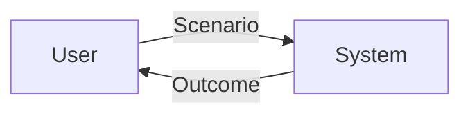

# Project Overview

## Название проекта

[Project Name]

## Описание проекта

[Brief product description and its purpose]

## Основной сценарий использования

[Description of main user stories, critical features, and primary use cases]

## Нефункциональные требования к системе

### Безопасность

- [Data protection requirements]
- [Authentication/authorization requirements]
- [Secret storage requirements]
- [Compliance standards (e.g., GDPR, SOC2)]

### Локализация

- **Supported Languages**: [Languages]
- **Date/Currency Formats**: [Formats]
- **Regional Settings**: [Settings]

### Доступность

- [Accessibility requirements for users with disabilities]
- [Assistive technology compatibility]
- [Interface accessibility standards (WCAG, etc.)]

### SEO

- [Page structure requirements]
- [Metadata requirements]
- [Indexing requirements]
- [Loading speed requirements]

---

# Бизнес цели

- [Key business objective 1]
- [Key business objective 2]
- [Key business objective 3]

---

# Роли пользователей

- **[Роль 1] —** [Описание роли и её возможностей. Например: Посетитель (Гость): Может просматривать занятия, мероприятия и статьи; может зарегистрировать аккаунт]
- **[Роль 2] —** [Описание]
- **[Роль 3] —** [Описание]

---

# Матрица прав доступа

| Функция     | [Роль 1] | [Роль 2] | [Роль 3] |
| ----------- | -------- | -------- | -------- |
| [Функция 1] | ✓        | ✓        | -        |
| [Функция 2] | ✓        | -        | -        |
| [Функция 3] | ✓        | ✓        | ✓        |

---

# Функциональные требования

## Epic - <epic_name>

- **id**: `EPIC-001`
- **description**: [High-level description of the epic]

### Features

#### Feature - <Feature_title>

- **id**: `FEAT-001`
- **description**: [Feature goal and expected outcome]

##### Role

- **Название роли**: [Role name]
- **Ценность / цели**: [Why this role needs the feature]
- **Ключевые сценарии**: [Critical flows enabled by the feature]
- **Метрики успеха**: [KPIs that indicate success]

##### User Stories

- **id**: `STORY-001`
  - **story**: Как [роль] хочу [действие], чтобы [цель] (Не должно содержать технические детали)
  - **diagram**:
    ```mermaid
    sequenceDiagram
        participant User
        participant System
        User->>System: [Action]
        System->>User: [Response]
    ```

##### Feature Requirements

- **FR-001**: [Specific requirement, e.g., "Кнопка отправки должна быть неактивной пока есть невалидные поля"]
- **FR-002**: [Specific requirement, e.g., "Данные, введённые в форму, должны сохраняться в сессии при перезагрузке страницы"]
- **FR-003**: [Specific requirement]

##### Acceptance criteria

- **id**: `AC-001`
  - **criteria**: [Measurable acceptance criterion]
- **id**: `AC-002`
  - **criteria**: [Measurable acceptance criterion]

## Diagram



---

# Таблица оценки объема работы [Эпик, фича, оценка объема работы в часах (примерно прикинь)]

- Epic-001. Поиск по каталогу - 3 часа
  ...

---

# AI Checklist

> Следовать инструкциям документа `.spec-core/llms.md`

- [ ] Уточнений не требуется (нет нечётких формулировок и неясностей), пометки, требующие уточнений, обработаны и удалены.
- [ ] Документ согласован со всеми элементами из блока References.
- [ ] Последние изменения прогнаны через `/review` > 1 раза; флаг снят перед запуском и выставлен заново через команду `/review`.
