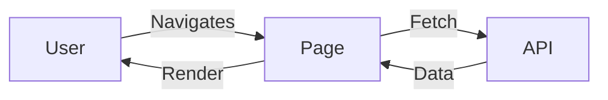

# UI/UX Template

## References

- [Link to PRD or related document]
- [Design system / component library]
- [Design mockups / Figma file]

---

## Платформа

### Devices / OS

- [Android / iOS / Desktop Web / PWA / macOS / Windows]
- [Браузеры и минимальные версии]

## Тема

- supported themes [light / dark / system]
- default theme

---

## App Layouts

### [Layout Name]

- id: `LAY-001`
- header
  - type: [fixed / sticky / none]
  - content: [nav, search, actions, breadcrumbs]
- sidebar
  - position: [left / right / none]
  - behavior: [collapsible, overlay, permanent]
  - access: [role-based visibility]
- footer
  - type: [fixed / static / none]
  - content: [legal, links, status]
- grid
  - mobile: [columns / gutters / container width]
  - tablet: [columns / gutters / container width]
  - laptop: [columns / gutters / container width]
  - desktop: [columns / gutters / container width]
- responsive
  - rules: [особенности поведения по брейкпоинтам]
  - nav: [collapse to burger at <X px]
- overrides
  - allowed: [что допустимо переопределять на уровне страницы]

> Дублируйте блок для каждого лэйаута: `LAY-002`, `LAY-003`, ...

---

## Pages

> Список страниц приложения. Для каждой страницы создаётся отдельный блок со ссылкой на лэйаут приложения по ID и описанием внутреннего контент-лэйаута.

### [Page Title]

- path: `/route/:id`
- layoutId: `LAY-001`
- pageContentLayout: `[e.g., two-column-product]`
  - areas: [описание зон/колонок и их роли]
  - responsive: [как схлопываются/перестраиваются на мобильных]
- elements
  - [Element name]: [description and purpose]
  - interactions: [click, hover, keyboard, gestures]
  - validation: [rules for forms]
- states
  - loading: [skeleton / loader / shimmer]
  - error: [toast / banner / inline]
  - empty: [placeholder / CTA]
  - success/offline: [поведение уcпеха, деградация offline]
- access
  - visibility: [public / private]
  - roles: [role names]
  - auth: [2FA / SSO / guest]
- data
  - dependencies: [data sources, caching strategy]
  - prefetch: [yes/no; route-level]
  - error handling: [retry, backoff]
- seo
  - title: [page title pattern]
  - meta: [description, canonical]
  - breadcrumbs: [structure]
- overrides
  - shell: [локальные изменения header/sidebar/footer]

> Дублируйте секцию для каждой страницы.

#### Page Diagram (optional)

---

## States

Опишите поведение UI при разных состояниях. Если есть разные варианты поведения при одном стейте, перечислите все.

### [Element name]

- on error: [toast / редирект / сообщение над формой / inline errors]
- on loading: [skeleton / loader / empty state]
- on empty: [пустой экран / CTA / guide]
- on disabled: [tooltip with reason / aria-disabled]
- focus/hover/active: [визуальные признаки]

> Дублируйте блок для ключевых элементов.

---

## Accessibility

### Hotkeys

- key: [e.g., Cmd+K]
- action: [Open Command Palette]
- scope: [global / page / component]

### A11y

- [ ] Цветовой контраст соответствует WCAG AA/AAA
- [ ] Поддержка Screen Reader (role, name, value)
- [ ] Полный фокус-цикл и видимый focus-ring
- [ ] ARIA-атрибуты корректны и не дублируют native semantics
- [ ] Управление с клавиатуры без мыши
- [ ] Живые регионы для динамических обновлений (aria-live)

---

## Assumptions (users)

- [допущения о поведении и навыках]
- [уровень цифровой грамотности]
- [контекст использования]

---

## Интернационализация

- enabled: [yes/no]
- locales: [ru, en, ...]
- content strategy: [hardcoded / i18n keys / server-driven]
- RTL support: [yes/no]
- date/number formats: [rules]

---

## Offline support

- strategy: [none / partial / full]
- caching: [assets / shell / data]
- sync: [background sync / conflict resolution]
- degraded UX: [read-only / queue actions]

---

## Performance UX

- perceived performance: [skeletons, instant feedback]
- code-splitting: [route-level, component-level]
- prefetching: [hover prefetch, viewport prefetch]
- image strategy: [responsive images, lazy-loading, formats]

---

## Telemetry & Feedback

- analytics: [events, naming, privacy]
- error reporting: [Sentry, user-facing messages]
- user feedback: [toasts, inline hints, surveys]

---

## AI Checklist

> Следовать инструкциям документа `.spec-core/llms.md`

- [ ] Уточнений не требуется; пометки, требующие уточнений, обработаны и удалены
- [ ] Документ согласован со всеми элементами из блока References
- [ ] Протестирована доступность (клавиатура, screen reader) на ключевых страницах
- [ ] Стратегии responsive и overrides непротиворечивы
- [ ] Последние изменения прогнаны через `/review` > 1 раза; флаг снят перед запуском и выставлен заново через команду `/review`
