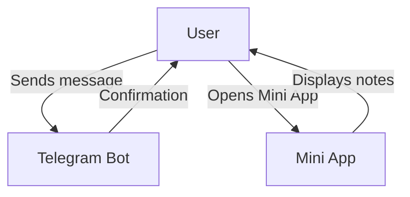
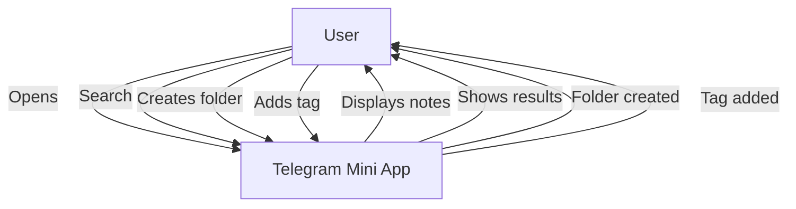
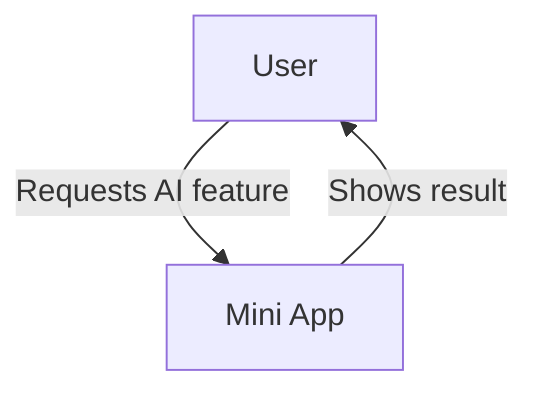

# Project Overview

## Project Name

Telegram Notes App (Smart Notes Bot)

## Project Description

Telegram Notes App is an application for collecting and managing notes, integrated with the Telegram messenger. Users can send notes to the bot at any time, and view and manage them through the Telegram Mini App (web interface). In the future, the system will be enhanced with an AI service for categorization and intelligent analysis of notes.

Key Features:
- **Telegram Bot** — users send text, photos, videos, and documents to the bot for quick note saving
- **Telegram Mini App** — web interface inside Telegram for viewing, organizing, and searching notes
- **AI Assistant** (future phase) — intelligent search and automatic suggestions for note organization

## Main Use Case

### Creating Notes
Users send text messages, photos, videos, or documents to the Telegram bot. The bot automatically saves them as notes with metadata (creation time, content type).

### Viewing and Organizing Notes
Users open the Telegram Mini App and see all their notes. They can:
- View notes in chronological order
- Search by content
- Organize notes into folders
- Add tags for categorization
- Filter by content type (text, photo, audio)

### AI Processing (future phase)
Users can request automatic extraction of key themes or intelligent grouping of related notes.

## Non-functional System Requirements

### Security

- User data is securely protected - only the account owner can access their notes
- All saved data is encrypted
- Access to media files is controlled
- User data isolation — each user sees only their own notes

### Localization

- **Supported Languages**: English
- **Date/Currency Formats**: Standard date/time format (MM/DD/YYYY)
- **Regional Settings**: Interface in English

### Accessibility

- Web interface must be responsive for all screen sizes (responsive design)
- Text is readable with appropriate font sizes for all devices. Respects browser/OS font size preferences.
- Contrasting colors for text and background per WCAG 2.1
- Keyboard navigation support in Mini App
- Alternative text for images in notes

### SEO

- N/A (application is only accessible through Telegram, does not require search engine indexing)

---

# Business Goals

- **Help users capture ideas instantly without friction**: Users can save thoughts and ideas the moment they occur without switching apps
- **Make personal knowledge accessible and searchable anywhere**: Provide quick access to saved information through intuitive search, folders, and tags
- **Enable better thinking through AI-powered insights**: Future AI features will help users discover patterns and connections in their notes
- **Provide a privacy-focused alternative to commercial note-taking apps**: Create a self-hostable notes application that users control completely

---

# User Roles

- **User** — Primary role. Can send notes to the bot, view and manage their notes through Mini App, organize them by folders and tags, use search. Will gain access to AI features in the future (possibly by subscription).

---

# Access Rights Matrix

| Function                          | User         |
| --------------------------------- | ------------ |
| Send notes to bot                 | ✓            |
| View own notes                    | ✓            |
| Edit notes                        | ✓            |
| Delete notes                      | ✓            |
| Create folders                    | ✓            |
| Add tags                          | ✓            |
| Search notes                      | ✓            |
| Use AI features                   | ✓ (future)   |

---

# Functional Requirements

## Epic - Collecting Notes via Telegram Bot

- **id**: `EPIC-001`
- **description**: Users can send text messages and media (photos, videos, documents) to the Telegram bot, which are automatically saved as notes. The bot must quickly and reliably process incoming messages, support different content types, and provide minimal feedback to the user.

### Features

#### Feature - Receiving Text Messages

- **id**: `FEAT-001`
- **description**: Bot receives text messages from users and saves them as notes with timestamp and metadata

##### Role

- **Role Name**: User
- **Value / Goals**: Quickly capture a thought or idea without needing to open a separate application or form
- **Key Scenarios**: User writes text to bot, bot confirms saving, note is available in Mini App
- **Success Metrics**:
  - Messages save reliably

##### User Stories

- **id**: `STORY-001`
  - **story**: As a user I want to send a text message to the bot so that it is automatically saved as a note
  - **diagram**:
    ```mermaid
    sequenceDiagram
        participant User
        participant TelegramBot
        User->>TelegramBot: Sends text message
        TelegramBot->>User: Notification "Note saved ✓"
    ```

- **id**: `STORY-002`
  - **story**: As a user I want to receive confirmation that the note was saved so I can be sure the information is not lost
  - **diagram**:
    ```mermaid
    sequenceDiagram
        participant User
        participant TelegramBot
        User->>TelegramBot: Sends message
        TelegramBot-->>User: Sends reaction or short message
    ```

##### Feature Requirements

- **FR-001**: Product accepts text notes of any length supported by Telegram
- **FR-002**: Notes automatically capture creation time
- **FR-003**: Bot sends confirmation to user after receiving message
- **FR-004**: If saving fails, bot notifies user to try sending again
- **FR-005**: Each user has access only to their own notes

##### Acceptance criteria

- **id**: `AC-001`
  - **criteria**: When sending text message to bot, user receives confirmation
- **id**: `AC-002`
  - **criteria**: Sent message appears in Mini App note list with correct creation time
- **id**: `AC-003`
  - **criteria**: Message is saved with correct User ID and accessible only to that user

#### Feature - Receiving Media Content

- **id**: `FEAT-002`
- **description**: Bot receives photos, videos, and documents, and saves them as notes with previews and metadata

##### Role

- **Role Name**: User
- **Value / Goals**: Save not only text, but also visual information, screenshots, and documents
- **Key Scenarios**: User photographs document → sends to bot → receives confirmation → can find photo in Mini App
- **Success Metrics**:
  - Support for main Telegram media types (photo, video, document)
  - Photos and videos appear in notes within seconds

##### User Stories

- **id**: `STORY-003`
  - **story**: As a user I want to send a photo to the bot so it is saved as a visual note with viewing capability
  - **diagram**:
    ```mermaid
    sequenceDiagram
        participant User
        participant TelegramBot
        User->>TelegramBot: Sends photo
        TelegramBot->>User: "Photo saved ✓"
    ```

##### Feature Requirements

- **FR-006**: Bot must support photos (photo), videos (video), documents (document). Voice messages are out of scope for MVP.
- **FR-007**: Photos, videos, and documents are stored securely and remain accessible
- **FR-009**: Note list displays photo previews
- **FR-010**: Media messages with captions are saved with their text. Media without captions can be found using date, type, folders, and tags.
- **FR-011**: Product supports files up to 20 MB. Larger files are rejected with notification to user.
- **FR-011a**: When user deletes a message in Telegram, the note and its files are removed
- **FR-ERR-001**: When operation fails, user receives clear error message (e.g., 'Failed to save note. Please try again.')

##### Acceptance criteria

- **id**: `AC-004`
  - **criteria**: When sending a photo, it appears in Mini App with thumbnail and is available for viewing in full size
- **id**: `AC-005`
  - **criteria**: Documents and videos are saved with correct filename and type, available for download
- **id**: `AC-006`
  - **criteria**: Files over 20 MB are rejected with clear notification message

#### Feature - Basic Bot Commands

- **id**: `FEAT-003`
- **description**: Bot supports management commands: /start, /help, /stats (notes statistics). Mini App opens via Telegram app button

##### Role

- **Role Name**: User
- **Value / Goals**: Understand how to use the bot and have quick access to Mini App
- **Key Scenarios**: New user sends /start → receives welcome and instructions → starts using
- **Success Metrics**:
  - Users successfully receive welcome message and instructions
  - Mini App opens correctly via app button

##### User Stories

- **id**: `STORY-005`
  - **story**: As a new user I want to receive instructions on how to use the bot, so that understand how to save notes
  - **diagram**:
    ```mermaid
    sequenceDiagram
        participant User
        participant TelegramBot
        User->>TelegramBot: /start
        TelegramBot->>User: Welcome message + instructions
    ```

##### Feature Requirements

- **FR-012**: /start command sends welcome message with feature description and usage examples
- **FR-013**: /help command displays list of available commands and instructions for organizing notes
- **FR-014**: Users can open the note management interface through a button in Telegram
- **FR-015**: /stats command shows user number of saved notes, date of first note, distribution by content type

##### Acceptance criteria

- **id**: `AC-007`
  - **criteria**: When entering /start new user receives clear welcome in English
- **id**: `AC-008`
  - **criteria**: App button correctly opens Mini App with user authentication
- **id**: `AC-009`
  - **criteria**: /stats shows current user notes statistics

## Diagram



---

## Epic - Telegram Mini App for Viewing and Managing Notes

- **id**: `EPIC-002`
- **description**: Web interface (Telegram Mini App) for viewing, organizing, and searching notes. User can view all their notes, filter by type, search by content, organize into folders, and add tags.

### Features

#### Feature - List and View Notes

- **id**: `FEAT-004`
- **description**: User sees list of all their notes in chronological order with pagination and ability to open individual note for detailed viewing

##### Role

- **Role Name**: User
- **Value / Goals**: Get quick access to all saved notes and see their content
- **Key Scenarios**: Open Mini App → see note list → click on note → view full content
- **Success Metrics**:
  - Note list loads successfully
  - Infinite scroll works smoothly (without delays when loading)

##### User Stories

- **id**: `STORY-007`
  - **story**: As a user I want to see list of all my notes in chronological order, so that quickly find recent entries
  - **diagram**:
    ```mermaid
    sequenceDiagram
        participant User
        participant MiniApp
        User->>MiniApp: Opens application
        MiniApp->>User: Displays notes with preview
    ```

- **id**: `STORY-008`
  - **story**: As a user I want to open individual note, so that see its full content and metadata
  - **diagram**:
    ```mermaid
    sequenceDiagram
        participant User
        participant MiniApp
        User->>MiniApp: Clicks on note
        MiniApp->>User: Opens detailed view
    ```

##### Feature Requirements

- **FR-016**: Main screen displays note list in reverse chronological order (newest on top)
- **FR-017**: Notes display helpful previews for quick scanning
- **FR-018**: More notes load smoothly as user scrolls
- **FR-019**: Clicking on note opens full view with ability to edit and delete
- **FR-020**: For media notes (photo, audio, video) detailed view displays viewing/playing capability
- **FR-021**: Times are shown in user's local timezone

##### Acceptance criteria

- **id**: `AC-010`
  - **criteria**: When opening Mini App user sees their note list loaded successfully
- **id**: `AC-011`
  - **criteria**: When scrolling down next notes are automatically loaded without delay
- **id**: `AC-012`
  - **criteria**: When clicking on note detailed view opens with full text and media files

#### Feature - Search Notes

- **id**: `FEAT-005`
- **description**: Full-text search over note content with filtering by content type and tags

##### Role

- **Role Name**: User
- **Value / Goals**: Quickly find needed information among many notes
- **Key Scenarios**: User enters keyword → system shows all notes containing this word → user opens needed note
- **Success Metrics**:
  - Search returns relevant results
  - Users can filter by content type and tags

##### User Stories

- **id**: `STORY-009`
  - **story**: As a user I want to enter keyword in search, so that find all notes containing this word
  - **diagram**:
    ```mermaid
    sequenceDiagram
        participant User
        participant MiniApp
        User->>MiniApp: Enters query in search bar
        MiniApp->>User: Displays found notes
    ```


##### Feature Requirements

- **FR-022**: Search responds smoothly as user types, showing results instantly
- **FR-023**: Search finds notes as you type
- **FR-024**: Search results show the most relevant notes first
- **FR-025**: User can filter results by tags and content type
- **FR-026**: Search supports partial word matching (e.g., "progr" will find "programming")

##### Acceptance criteria

- **id**: `AC-013`
  - **criteria**: When entering query in search bar, results appear instantly
- **id**: `AC-014`
  - **criteria**: Tag filters correctly limit search results
- **id**: `AC-015`
  - **criteria**: Search finds notes even when entering part of word

#### Feature - Organizing Notes: Folders and Tags

- **id**: `FEAT-006`
- **description**: User can create folders for grouping notes and add tags for flexible categorization

##### Role

- **Role Name**: User
- **Value / Goals**: Structure large number of notes for convenient access and search
- **Key Scenarios**:
  - Create folder "Work" → move corresponding notes there → open folder and see only work notes
  - Add tag #idea to note → find all notes with this tag
- **Success Metrics**:
  - Users can successfully create folders and tags
  - Organization features work as expected

##### User Stories

- **id**: `STORY-011`
  - **story**: As a user I want to create folder, so that group related notes together
  - **diagram**:
    ```mermaid
    sequenceDiagram
        participant User
        participant MiniApp
        User->>MiniApp: Clicks "Create folder"
        MiniApp->>User: Shows form with name
        User->>MiniApp: Enters name "Work"
        MiniApp->>User: Shows new folder in list
    ```

- **id**: `STORY-012`
  - **story**: As a user I want to move note to folder, so that it was organized by topic
  - **diagram**:
    ```mermaid
    sequenceDiagram
        participant User
        participant MiniApp
        User->>MiniApp: Opens note → Selects "Move to folder"
        MiniApp->>User: Shows folder list
        User->>MiniApp: Selects folder "Work"
        MiniApp->>User: Note moved
    ```

- **id**: `STORY-013`
  - **story**: As a user I want to add tags to note, so that flexibly categorize it by multiple topics
  - **diagram**:
    ```mermaid
    sequenceDiagram
        participant User
        participant MiniApp
        User->>MiniApp: Opens note → Clicks "Add tag"
        MiniApp->>User: Shows input for tag
        User->>MiniApp: Enters "idea", "project"
        MiniApp->>User: Tags are displayed on note
    ```

- **id**: `STORY-014`
  - **story**: As a user I want to view all notes with specific tag, so that see related information
  - **diagram**:
    ```mermaid
    sequenceDiagram
        participant User
        participant MiniApp
        User->>MiniApp: Clicks on tag "idea"
        MiniApp->>User: Shows all notes with tag
    ```

##### Feature Requirements

- **FR-028**: Users can create folders with custom names (up to 50 characters). Folders cannot be placed inside other folders.
- **FR-029**: Note can be in only one folder at a time, or not in any folder (inbox)
- **FR-030**: User can move notes between folders via UI
- **FR-031**: User can add multiple tags to note (up to 10 tags, each tag max 30 characters including emojis)
- **FR-032**: Users type tag names and they're created instantly. Tags preserve exact formatting and support emojis like 💡 or 🔥
- **FR-033**: When adding tags, users can see and reuse existing tags
- **FR-034**: Main screen must have folder list and list of all used tags
- **FR-035**: When clicking on folder or tag filtered note list opens
- **FR-036**: User can rename or delete folder (when deleting folder notes are not deleted, remain in inbox)

##### Acceptance criteria

- **id**: `AC-016`
  - **criteria**: User can create folder, name is correctly saved and displayed
- **id**: `AC-017`
  - **criteria**: Note moves to folder and is displayed only in this folder (not duplicated)
- **id**: `AC-018`
  - **criteria**: When adding tag to note, tag is displayed on note card and in list of all tags
- **id**: `AC-019`
  - **criteria**: When clicking on tag all notes with this tag open

#### Feature - Editing and Deleting Notes

- **id**: `FEAT-007`
- **description**: User can edit note text and delete notes

##### Role

- **Role Name**: User
- **Value / Goals**: Fix errors, add information, delete outdated notes
- **Key Scenarios**: Open note → press "Edit" → make changes → save
- **Success Metrics**:
  - Users can successfully edit and save changes
  - Edits are saved and reflected in note list

##### User Stories

- **id**: `STORY-015`
  - **story**: As a user I want to edit note text, so that fix error or add information
  - **diagram**:
    ```mermaid
    sequenceDiagram
        participant User
        participant MiniApp
        User->>MiniApp: Opens note → Clicks "Edit"
        MiniApp->>User: Shows text editor
        User->>MiniApp: Makes changes → Clicks "Save"
        MiniApp->>User: Note updated
    ```

- **id**: `STORY-016`
  - **story**: As a user I want to delete note, so that remove outdated information
  - **diagram**:
    ```mermaid
    sequenceDiagram
        participant User
        participant MiniApp
        User->>MiniApp: Opens note → Clicks "Delete"
        MiniApp->>User: Shows confirmation
        User->>MiniApp: Confirms deletion
        MiniApp->>User: Note deleted, return to list
    ```

##### Feature Requirements

- **FR-037**: In detailed note view there must be button "Edit" (for text notes)
- **FR-038**: When editing text editor opens with ability to change content
- **FR-039**: Changes are saved when pressing button "Save"
- **FR-040**: When note is edited, it shows when it was last updated. If same note is edited from multiple devices, the most recent save is kept.
- **FR-041**: Button "Delete" must show confirmation dialog before deletion
- **FR-042**: Deleted notes and their media are permanently removed from the system

##### Acceptance criteria

- **id**: `AC-020`
  - **criteria**: When editing text and saving, changes are displayed in note list
- **id**: `AC-021`
  - **criteria**: When deleting note, it disappears from list and is not accessible via search
- **id**: `AC-022`
  - **criteria**: Deletion requires confirmation, accidental deletion is impossible

## Diagram



---

## Epic - AI Service for Processing Notes (Future Phase)

- **id**: `EPIC-003`
- **description**: AI-powered features for automatic note organization and intelligent search

### Features

#### Feature - Automatic Tag Generation

- **id**: `FEAT-009`
- **description**: AI service analyzes note content and suggests relevant tags automatically

##### Role

- **Role Name**: User
- **Value / Goals**: Not spend time on manual note categorization
- **Key Scenarios**: Create note → AI suggests tags → user confirms or corrects
- **Success Metrics**:
  - Suggested tags are relevant to note content
  - Users can accept or modify suggested tags

##### User Stories

- **id**: `STORY-018`
  - **story**: As a user I want to so that system automatically suggested tags for new note, so that save time
  - **diagram**:
    ```mermaid
    sequenceDiagram
        participant User
        participant Bot
        User->>Bot: Sends note
        Bot->>User: "Note saved with tags: #work #project"
    ```

##### Feature Requirements

- **FR-048**: When saving text note AI service analyzes content and suggests 2-5 tags
- **FR-049**: Tags are generated based on key themes and entities in text
- **FR-050**: User can accept, reject, or modify suggested tags
- **FR-051**: AI considers user's tag history for personalizing suggestions

##### Acceptance criteria

- **id**: `AC-026`
  - **criteria**: When saving note via bot user receives relevant suggested tags
- **id**: `AC-027`
  - **criteria**: Suggested tags are relevant to note content (manual verification on sample)

#### Feature - Intelligent Search with Semantic Understanding

- **id**: `FEAT-010`
- **description**: AI-powered search that understands query meaning and finds relevant notes even if exact words don't match

##### Role

- **Role Name**: User
- **Value / Goals**: Find information by meaning, not only by keywords
- **Key Scenarios**: User searches for "startup ideas" → finds notes with "business concepts", "entrepreneurship"
- **Success Metrics**:
  - Semantic search finds relevant results by meaning
  - Users can find notes without exact keyword matches

##### User Stories

- **id**: `STORY-019`
  - **story**: As a user I want to find notes by query meaning, so that not remember exact phrasings
  - **diagram**:
    ```mermaid
    sequenceDiagram
        participant User
        participant MiniApp
        User->>MiniApp: Enters "business ideas"
        MiniApp->>User: Shows results
    ```

##### Feature Requirements

- **FR-052**: Search understands context and intent to surface the most relevant notes
- **FR-053**: Search finds notes by meaning, not just exact keywords
- **FR-054**: Results show notes with related meanings even when wording differs
- **FR-055**: Semantic search is available as option in search bar (keyword/semantic toggle)

##### Acceptance criteria

- **id**: `AC-028`
  - **criteria**: When enabling semantic search query "startup ideas" finds notes with "business concept"
- **id**: `AC-029`
  - **criteria**: Semantic search returns relevant results based on meaning

## Diagram



---

# Work Effort Estimation Table

## MVP (Phase 1): Basic functionality without AI

- **EPIC-001. Collecting notes via Telegram Bot** — 40 hours
  - FEAT-001. Receiving text messages — 12 hours
  - FEAT-002. Receiving media content — 20 hours
  - FEAT-003. Basic Bot Commands — 8 hours

- **EPIC-002. Telegram Mini App** — 80 hours
  - FEAT-004. List and View Notes — 20 hours
  - FEAT-005. Search Notes — 15 hours
  - FEAT-006. Organization: folders and tags — 30 hours
  - FEAT-007. Editing and deleting — 15 hours

**Total MVP: 120 hours (3 weeks at full-time development)**

## Phase 2: AI features

- **EPIC-003. AI service** — 40 hours
  - FEAT-009. Automatic Tag Generation — 20 hours
  - FEAT-010. Semantic search — 20 hours

**Total Phase 2: 40 hours (1 week at full-time development)**

**Total work volume: 160 hours (4 weeks at full-time development)**

---


# Out of Scope (Not included in current version)

- **Voice messages**: Recording and storing voice notes (post-MVP feature)
- **Collaborative work on notes**: Ability to share notes with other users or work on them collaboratively
- **Synchronization with external services**: Integration with Notion, Evernote, Google Drive
- **Web version outside Telegram**: Standalone web application or native mobile applications
- **OCR for images**: Automatic text recognition in photos (can be added in Phase 3)
- **Voice-to-text**: Transcription of voice messages to text (can be added in Phase 2)
- **Reminders and notifications**: Reminder system for notes with date/time
- **Note export**: Ability to export all notes to PDF, CSV, JSON
- **Dark theme**: Theme switcher (can be added in Phase 2)
- **Multi-user architecture for teams**: Workspace for team collaboration on notes
- **Edit history and undo**: Version control for tracking changes over time
- **Automatic recovery from service interruptions**: Robust error handling and retry mechanisms

---

# AI Checklist

> Follow instructions in document `.spec-core/llms.md`

- [ ] No clarifications needed (no vague formulations or ambiguities), notes requiring clarification are processed and removed.
- [ ] Document is aligned with all elements from References block.
- [ ] Latest changes are run through `/review` > 1 times; flag removed before running and set again via command `/review`.
